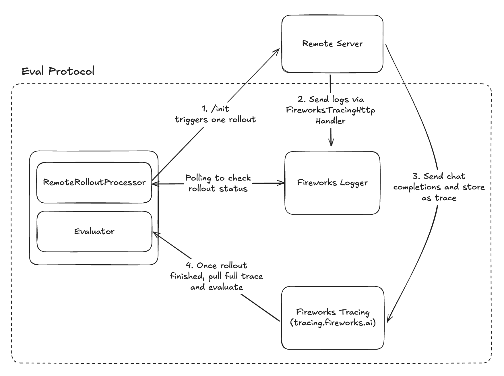
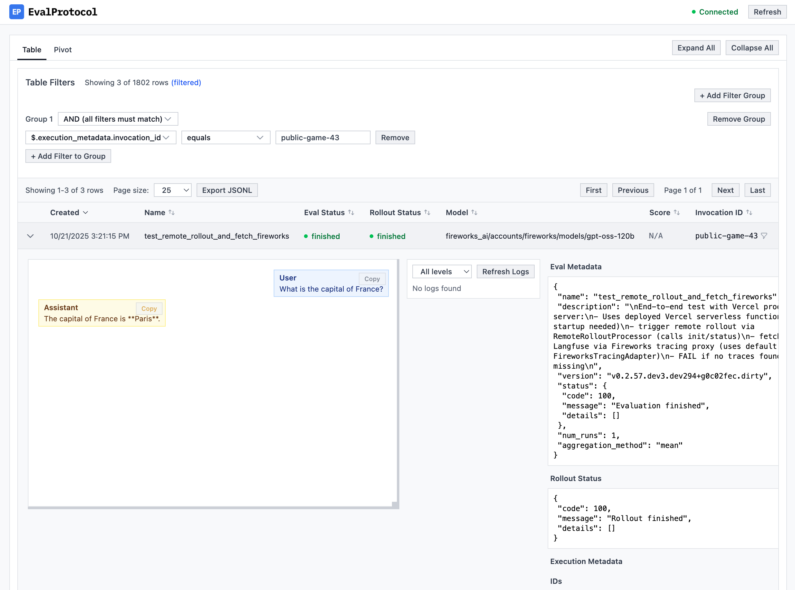

<h1 align="center">Remote Rollout Processor Hello World</h1>

<p align="center">
  
</p>

<p align="center">
    Run distributed LLM evaluations with remote rollout processing and automatic trace collection. No manual trace management required.
</p>

> **📖 New to Remote Rollout Processing?** Read the complete [Remote Rollout Processor Tutorial](https://evalprotocol.io/tutorial/remote-rollout-processor) first - this repository serves as the working example for that tutorial.

<br/>

## Quick Start

### Installation

```bash
pip install eval-protocol
```

### Environment Setup

Set up your API keys for the models and tracing platform you want to use:

```bash
export FIREWORKS_API_KEY="your_fireworks_key"
```

### Running the Example

#### Option 1: Python Server

Start the Python server:
```bash
python -m remote_server
```

In another terminal, run the evaluation test:
```bash
pytest quickstart.py -vs
```

#### Option 2: TypeScript Server

Start the TypeScript server:
```bash
cd typescript-server
pnpm install
pnpm run dev
```

In another terminal, run the same evaluation test:
```bash
pytest quickstart.py -vs
```

### What's Happening

1. **/init triggers one rollout**: Eval Protocol makes a POST `/init` request with the row payload and correlation metadata to our server on `http://127.0.0.1:3000`, which triggers the rollout (in this case a simple chat completion asking "What is the capital of France").
2. **Send logs via [`FireworksTracingHttpHandler`](https://github.com/eval-protocol/python-sdk/blob/main/eval_protocol/log_utils/fireworks_tracing_http_handler.py)**: Our server emits structured logs tagged with the rollout’s correlation fields.
3. **Send chat completions and store as trace**: Our chat completion calls are recorded as traces in Fireworks.
4. **Once rollout finished, pull full trace and evaluate**: Eval Protocol polls Fireworks for a completion signal, then pulls the trace back and scores.


### Viewing Results

After running the test, start the local UI server:

```
ep logs
```

At `http://localhost:8000`, you'll see results like:

<p align="center">
  
</p>

## Learn More

- [Eval Protocol Documentation](https://evalprotocol.io/introduction)
- [Remote Rollout Processor Tutorial](https://evalprotocol.io/tutorial/remote-rollout-processor)
- [Fireworks AI Platform](https://fireworks.ai)
